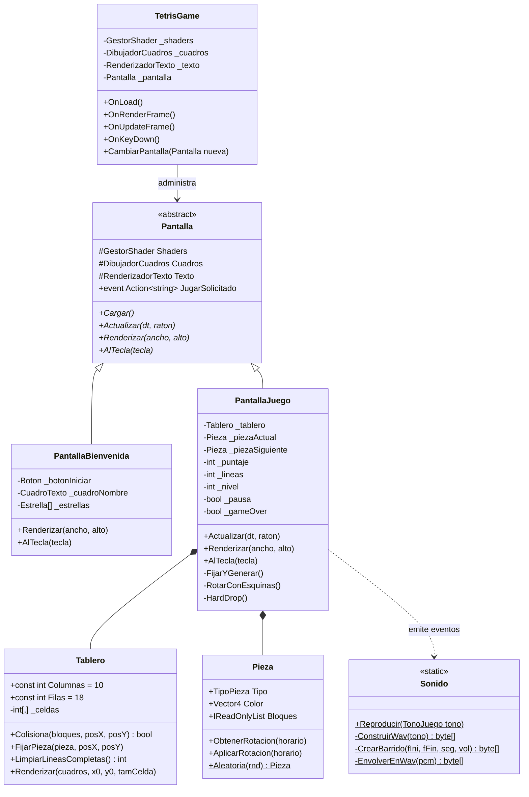
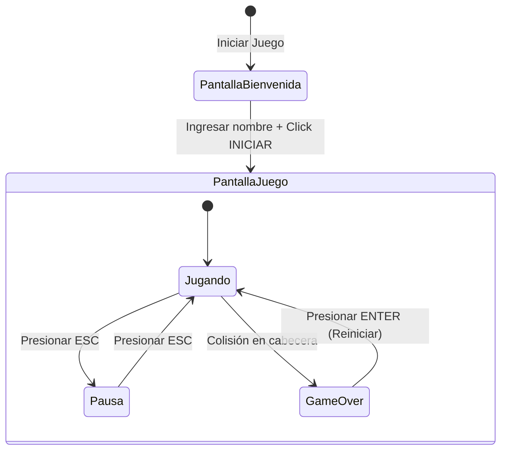

# Reporte de Proyecto: Desarrollo de un Videojuego Tetris 2D con OpenTK y OpenGL
## Actividad #10 — Fases 1, 2 y 3

---

### Datos Generales
- **Institución:** Universidad / Facultad de Ingeniería
- **Materia:** Graficación por Computadora
- **Estudiantes / Desarrolladores:** Adrián G. Rangel / Aarat Zapién
- **Tecnologías utilizadas:** C# (.NET 8.0), OpenTK 4.9.4 (OpenGL 4.0), System.Drawing.Common, System.Windows.Extensions
- **Repositorio en GitHub:** [https://github.com/AdrianGRangel/Proyecto-TG-Tetris](https://github.com/AdrianGRangel/Proyecto-TG-Tetris)

---

## 1. Introducción y Objetivos

El presente proyecto documenta el diseño, arquitectura e implementación integral de un videojuego 2D clásico (**Tetris**) desarrollado desde cero en el lenguaje C# utilizando la biblioteca multiplataforma **OpenTK** para el enlace con la API gráfica de bajo nivel **OpenGL**.

### 1.1 Objetivo General
Implementar un sistema de videojuego 2D interactivo aplicando conceptos fundamentales de computación gráfica (transformaciones afines, renderizado por hardware, shaders GLSL, mapas de caracteres/atlas), estructuras de datos discretas (matrices para representación de mundos 2D), algoritmos de colisión y síntesis digital procedural de audio (PCM).

### 1.2 Objetivos Específicos por Fase
- **Fase 1 (Entorno base y bienvenida arcade):**
  - Configuración del proyecto en .NET 8 con OpenTK.
  - Implementación de la ventana principal `TetrisGame` con ciclo de renderizado ortográfico en píxeles de framebuffer.
  - Creación de shaders básicos para polígonos coloreados y glifos texturizados.
  - Construcción de un generador de atlas de fuentes en memoria (`GeneradorFuenteAtlas`) y pantalla inicial de bienvenida interactiva con entrada de nombre y efectos visuales de cielo estrellado.
- **Fase 2 (Tablero matricial, tetrominós y mecánicas centrales):**
  - Creación de las 7 piezas clásicas (`I, O, T, S, Z, J, L`) con coordenadas relativas en cajas lógicas de $4 \times 4$.
  - Implementación de transformaciones geométricas para rotación horaria y antihoraria.
  - Desarrollo de la cuadrícula matricial `int[10, 18]` para almacenamiento de celdas ocupadas.
  - Algoritmo de detección de colisiones con bordes laterales, fondo y bloques fijos.
  - Detección y limpieza de líneas completas con compactación hacia abajo.
  - Sistema de puntuación acumulativa y detección de Game Over.
- **Fase 3 (Preview, dificultad progresiva, pausa y audio procedural):**
  - Panel de vista previa de la siguiente pieza (*preview box*) con cálculo dinámico de *Bounding Box* para centrado perfecto.
  - Sistema de niveles con aceleración progresiva de la gravedad mediante funciones exponenciales de tiempo.
  - Gestión de máquina de estados para pausa del juego (`ESC`) con renderizado de interfaz superpuesta.
  - Motor procedural de audio digital en formato PCM (22,050 Hz, 16 bits mono) encapsulado dinámicamente en memoria en contenedores RIFF/WAVE sin dependencias de archivos externos.

---

## 2. Fundamentos Teóricos y Conceptos de Graficación

### 2.1 Representación Matricial y Transformación de Coordenadas
El área de juego de Tetris se modela como un espacio bidimensional discreto de $10 \times 18$ celdas:

$$\mathbf{M} \in \mathbb{Z}^{10 \times 18}$$

Donde cada elemento $M[x, y]$ almacena $0$ si la celda está vacía o un valor de $1$ a $7$ representativo del color y tipo de pieza fijada.

Para traducir una posición lógica de celda $(x, y)$ a las coordenadas gráficas continuas en pantalla (espacio de framebuffer de OpenGL), se aplica la transformación afín directa:

$$\text{pixelX} = x_0 + x \cdot \text{tamCelda}$$

$$\text{pixelY} = y_0 + y \cdot \text{tamCelda}$$

Donde $(x_0, y_0)$ es el origen de la esquina superior izquierda del tablero y $\text{tamCelda}$ es el tamaño dinámico en píxeles calculado en base a la altura útil de la ventana.

```
       0   1   2  ...  9  (Columnas: 10)
     +---+---+---+---+---+
 0   |   |   |   |   |   |
 1   |   |   |   |   |   |  --> Transforma cada celda:
 .   |   |   |   |   |   |      pixelX = x0 + col * tamCelda
 .   |   |   |   |   |   |      pixelY = y0 + fila * tamCelda
17   |   |   |   |   |   |
     +---+---+---+---+---+
  (Filas: 18)
```

### 2.2 Transformaciones Geométricas y Rotación en Cuadrícula 4×4
Cada tetrominó se define mediante un conjunto de 4 coordenadas discretas relativas $\{(x_i, y_i)\}_{i=1}^4$ contenidas en una caja de $4 \times 4$ ($x, y \in [0, 3]$).

La rotación rígida discreta de $90^\circ$ en sentido horario se calcula aplicando la transformación:

$$(x', y') = (3 - y, x)$$

Mientras que la rotación en sentido antihorario corresponde a su inversa:

$$(x', y') = (y, 3 - x)$$

Para evitar que las piezas queden atascadas contra las paredes laterales o bloques al girar, se implementó un mecanismo de *wall-kicks* (pruebas de ajuste horizontal en los desplazamientos $\Delta x \in \{0, -1, +1\}$).

### 2.3 Bounding Box (Caja Delimitadora)
Dado que las diferentes piezas tienen geometrías y extensiones asimétricas (por ejemplo, la pieza **I** es de $4 \times 1$ mientras que la **O** es de $2 \times 2$), el centrado directo por origen genera desfases estéticos. 

Para resolverlo, se calcula la caja envolvente mínima de la pieza:

$$x_{\min} = \min_{i}(bx_i), \quad x_{\max} = \max_{i}(bx_i)$$

$$y_{\min} = \min_{i}(by_i), \quad y_{\max} = \max_{i}(by_i)$$

$$\text{anchoPieza} = (x_{\max} - x_{\min} + 1) \cdot \text{tamMini}$$

$$\text{altoPieza} = (y_{\max} - y_{\min} + 1) \cdot \text{tamMini}$$

Esto permite situar el preview con márgenes equidistantes dentro del panel:

$$\text{px}_0 = \text{cajaX} + \frac{\text{anchoCaja} - \text{anchoPieza}}{2}$$

$$\text{py}_0 = \text{cajaY} + \frac{\text{altoCaja} - \text{altoPieza}}{2}$$

### 2.4 Dificultad Progresiva y Curva de Caída
El intervalo de tiempo de caída automática por gravedad disminuye exponencialmente con cada nivel de acuerdo con la función:

$$\Delta t_{\text{gravedad}} = \max\left(0.05\,\text{s},\; T_{\text{base}} \cdot 0.85^{(\text{nivel} - 1)}\right)$$

Donde $T_{\text{base}} = 0.90\,\text{s}$. Con cada 10 líneas despejadas, el jugador avanza de nivel, incrementando la velocidad de descenso y multiplicando el puntaje obtenido.

### 2.5 Síntesis Digital de Audio (PCM) y Encapsulación RIFF/WAVE
En lugar de depender de activos de audio pesados en disco que puedan provocar fallos de carga o problemas de compatibilidad, se diseñó un sintetizador de audio senoidal programable en memoria:

$$s(t) = A(t) \cdot \sin(2\pi \cdot f(t) \cdot t)$$

Donde $f(t)$ se interpola linealmente entre una frecuencia inicial $f_{\text{inicio}}$ y final $f_{\text{fin}}$ para producir barridos ascendentes o descendentes. Cada muestra se cuantiza a 16 bits signed little-endian con una tasa de muestreo de $f_s = 22,050\,\text{Hz}$:

$$\text{PCM}_{16} = \text{clamp}\left(s(t) \cdot 32767, -32768, 32767\right)$$

Los bytes se empaquetan en memoria anexando el encabezado estándar **RIFF WAVE** de 44 bytes y se reproducen asíncronamente con `System.Media.SoundPlayer`.

---

## 3. Arquitectura del Software

El proyecto sigue una arquitectura desacoplada basada en estados y pantallas, donde la ventana principal gestiona los recursos globales y el ciclo de eventos, delegando la lógica y el dibujo a la pantalla activa.

### 3.1 Diagrama de Clases y Arquitectura General



### 3.2 Máquina de Estados del Videojuego



---

## 4. Descripción de Componentes Clave

### 4.1 Pantalla de Bienvenida (`Pantallas/PantallaBienvenida.cs`)
- Ofrece una atmósfera temática arcade con 60 estrellas procedimentales, logotipo con efecto *glow* de neón mediante pasadas múltiples de shader con offsets radiales, cuadro de texto para capturar el nombre del jugador y botón con verificación de texto no vacío.
- Dispara el evento `JugarSolicitado` con el nombre introducido, iniciando la transición fluida hacia el juego.

### 4.2 Tetrominós y Transformaciones (`Pieza.cs`)
- Define las 7 formas estándar con sus colores característicos:
  - **I:** Cian (`#00E6FF`)
  - **O:** Amarillo (`#FFD933`)
  - **T:** Magenta (`#F240D9`)
  - **S:** Verde (`#40FF8C`)
  - **Z:** Rojo (`#FF4040`)
  - **J:** Azul (`#3373FF`)
  - **L:** Naranja (`#FF991A`)
- Realiza rotaciones no destructivas (`ObtenerRotacion`) que devuelven nuevas coordenadas para evaluación previa de colisiones antes de confirmarlas (`AplicarRotacion`).

### 4.3 Tablero y Motor de Colisiones (`Tablero.cs`)
- Evalúa colisiones en tiempo constante por cada bloque: límites $x < 0$, $x \ge 10$, $y < 0$, $y \ge 18$ o si $M[x, y] \ne 0$.
- La limpieza de líneas (`LimpiarLineasCompletas`) barre la matriz de abajo hacia arriba; al encontrar una fila sin ceros, copia recursivamente las filas superiores hacia abajo y limpia la cabecera, contabilizando las líneas eliminadas.
- El método `Renderizar` dibuja el panel oscuro, el marco de neón cian, la cuadrícula sutil y los bloques fijos con un efecto biselado (*bevel*) que aporta tridimensionalidad visual.

### 4.4 Lógica de Juego y UI (`Pantallas/PantallaJuego.cs`)
- **Controles soportados:**
  - `←` / `→`: Desplazamiento lateral validado con colisión.
  - `↓`: Descenso acelerado (*Soft Drop*), suma $+1$ punto por celda.
  - `↑`: Caída instantánea (*Hard Drop*), suma $+2$ puntos por celda hasta el suelo.
  - `Espacio`: Rotación con asistencia de esquinas (*Wall Kicks*).
  - `ESC`: Alterna pausa y reanudación.
  - `Enter`: Reinicia partida al estar en Game Over.
- **Sistema de Puntos y Progresión:**
  
| Líneas Simultáneas | Puntos Base | Puntos con Nivel $N$ |
| :---: | :---: | :---: |
| **1 Línea** | 100 | $100 \times N$ |
| **2 Líneas** | 300 | $300 \times N$ |
| **3 Líneas** | 500 | $500 \times N$ |
| **4 Líneas (Tetris)** | 800 | $800 \times N$ |

- **Subida de nivel:** Cada 10 líneas acumuladas ($\text{nivel} = \lfloor\text{líneas}/10\rfloor + 1$).
- **Interfaz Lateral:** Tarjeta visual con nombre del usuario, puntaje, líneas acumuladas, nivel actual con barra de texto de progreso ($X/10\text{ para subir}$), cajón de vista previa centrado y panel de ayuda de controles.

### 4.5 Módulo de Audio Procedural (`Audio/Sonido.cs`)
Genera 6 tonalidades arcade calculadas matemáticamente:

| Evento | Tono | Frecuencia Inicial | Frecuencia Final | Duración |
| :--- | :--- | :---: | :---: | :---: |
| **Mover** | Corto agudo | 980 Hz | 980 Hz | 50 ms |
| **Rotar** | Tono medio | 740 Hz | 740 Hz | 50 ms |
| **Fijar** | Golpe descendente | 330 Hz | 300 Hz | 100 ms |
| **Línea** | Barrido ascendente triunfal | 660 Hz | 990 Hz | 180 ms |
| **Nivel** | Doble octava brillante | 440 Hz | 880 Hz | 280 ms |
| **GameOver** | Barrido grave descendente | 420 Hz | 90 Hz | 700 ms |

### 4.6 Sistema de Música de Fondo (BGM) y Pistas de Audio (`Audio/ReproductorMusica.cs`)
Adicionalmente a los efectos de sonido procedurales, se implementó un motor de reproducción de música continua sin cortes utilizando la biblioteca **NAudio** y decodificación por hardware con **Windows Media Foundation**, compatible de forma nativa con formatos `.m4a` (AAC) y `.wav`:

- **Música del Menú / Bienvenida (`videoplayback (1)`):** Pista temática arcade que ambienta la pantalla inicial mientras el jugador introduce su nombre.
- **Música de Partida Principal - Tema A (`videoplayback (2)`):** Melodía clásica de Tetris en bucle continuo (`LoopStream`), que se reproduce durante la partida.
- **Tema Alternativo - Tema B (`videoplayback (1)`):** Pista secundaria alternable en tiempo real presionando la tecla `T`.
- **Fanfarria de Game Over (`videoplayback`):** Pista de final de partida (15 segundos) que se dispara automáticamente cuando los bloques saturan el tablero.
- **Controles Dinámicos:**
  - `M` / `F2`: Activa o silencia la música al instante (*Mute/Unmute*).
  - `T`: Conmuta entre Tema A y Tema B durante el juego.
  - `ESC`: Al pausar la partida, la música se suspende automáticamente y se reanuda al despausar.


## 5. Pruebas y Evidencias de Funcionamiento

> [!NOTE]
> Para adjuntar las capturas en el reporte final, ejecute el proyecto con `dotnet run` y tome las capturas correspondientes en los momentos señalados.

### Evidencias de Fase 1 y Fase 2

#### 1. Pantalla de Bienvenida Arcade (Fase 1)
- **Descripción:** Ventana con título con resplandor neón, cielo de estrellas animado, caja de entrada de texto con el nombre del jugador y botón `INICIAR JUEGO`.
- *(Insertar aquí Captura de Pantalla de Bienvenida)*

#### 2. Tablero de Juego Inicial (Fase 2)
- **Descripción:** Visualización de la cuadrícula de $10 \times 18$, panel de información lateral y primera pieza generada en la cabecera.
- *(Insertar aquí Captura del Tablero de Juego)*

#### 3. Pieza en Movimiento y Rotación (Fase 2)
- **Descripción:** Demostración de desplazamiento lateral y giro de $90^\circ$ en sentido horario.
- *(Insertar aquí Captura de Pieza en Movimiento y Pieza Rotada)*

#### 4. Detección de Colisiones y Línea Eliminada (Fase 2)
- **Descripción:** Los bloques se fijan en el fondo y las filas completas desaparecen desplazando la torre hacia abajo.
- *(Insertar aquí Captura de Línea Eliminada)*

---

### Evidencias Formales de Fase 3 (Requeridas en PDF)

#### Evidencia 1: Panel de Vista Previa de la Siguiente Pieza (Preview)
- **Descripción:** Caja `SIGUIENTE` en la barra lateral que muestra la pieza futura centrada con precisión geométrica mediante *Bounding Box*.
- *(Insertar aquí Captura del Preview Box con pieza siguiente)*

#### Evidencia 2: Nivel Actual y Contador de Líneas
- **Descripción:** Panel lateral reflejando el nivel alcanzado ($N \ge 1$), contador de líneas eliminadas y texto de progreso hacia el siguiente nivel (`X/10 PARA SUBIR`).
- *(Insertar aquí Captura donde se aprecie Nivel, Líneas y Progreso)*

#### Evidencia 3 / 4: Pantalla de Pausa
- **Descripción:** Overlay oscuro semitransparente activado mediante la tecla `ESC` mostrando el cartel de `"P A U S A"` con borde dorado y aviso `"PRESIONA ESC PARA CONTINUAR"`.
- *(Insertar aquí Captura del Overlay de Pausa)*

#### Evidencia 5: Pantalla de Game Over
- **Descripción:** Estado terminal al saturarse la cabecera del tablero con tarjeta roja `"GAME OVER"`, resumen de puntaje final, líneas totales y la instrucción `"PRESIONA ENTER PARA JUGAR DE NUEVO"`.
- *(Insertar aquí Captura del Overlay de Game Over)*

---

## 6. Conclusiones

1. **Eficiencia en Gráficos 2D:** La utilización directa de shaders GLSL y matrices de proyección ortográfica en OpenTK demostró ser una solución de alto rendimiento, permitiendo renderizar primitivas, fuentes vectoriales basadas en atlas y efectos visuales de neón sin sobrecarga.
2. **Robustez Algorítmica:** La separación entre coordenadas lógicas del tablero y coordenadas gráficas del framebuffer garantizó una detección de colisiones determinista, precisa y desacoplada de la resolución de pantalla.
3. **Innovación en Audio en Memoria:** La síntesis digital procedural en formato PCM y empaquetado WAV en memoria evitó el uso de dependencias externas complejas, logrando un juego portátil, autosuficiente y fiel al estilo retro de las máquinas arcade de los años 80 y 90.
4. **Arquitectura Extensible:** El diseño modular orientado a pantallas facilitó una transición limpia desde la bienvenida (Fase 1) hasta las mecánicas profundas (Fases 2 y 3).

---

## 7. Instrucciones de Compilación y Ejecución

```powershell
# Clonar el repositorio
git clone https://github.com/AdrianGRangel/Proyecto-TG-Tetris.git
cd Proyecto-TG-Tetris

# Restaurar paquetes y compilar solución
dotnet build

# Ejecutar el videojuego
dotnet run
```
